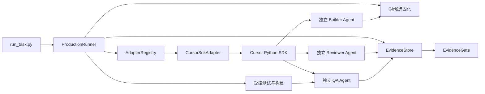

# Cursor SDK Production Runner 自动流转扩展方案

## 1. 文档目的

本文设计在现有 `multi-agent-flow` 中新增 Cursor SDK 宿主适配能力，使 Cursor 可以像 Codex CLI、Antigravity CLI 一样被 Production Runner 确定性调度，完成：

```text
Builder → Reviewer → Runner受控命令 → QA → EvidenceGate → 等待用户验收
```

本方案只做增量扩展，必须保证：

1. 不改变 Codex CLI、Antigravity CLI 的现有行为、默认配置和测试结果；
2. 不修改 8 个业务角色的职责、权限、状态流转规则和角色文件语义；
3. Cursor 未安装、未配置或 SDK 不可用时，不影响原有宿主运行；
4. Cursor 适配器必须显式选择，不得静默替换或降级现有 Adapter；
5. 无法证明独立会话、工作区边界或结果身份时必须 Fail-Closed。

## 2. 现状与目标差距

### 2.1 当前已有能力

现有 Production Runner 通过 `BaseHostAdapter` 抽象宿主，实现了：

- `codex_cli`：Codex CLI 独立会话；
- `antigravity`：Antigravity CLI 独立会话；
- Builder、Reviewer、QA 串行调度；
- Git 基线和候选 Commit 固化；
- Checkpoint、取消、超时和断点恢复；
- Reviewer/QA 结构化协议；
- Runner 受控安全扫描、测试、构建及 `git diff --check`；
- Evidence 持久化与 EvidenceGate 重放验证。

Cursor 当前只有角色文件导出能力。IDE 主对话能够启动 `flow-dev`、`flow-reviewer` 等 Cursor 子代理，但该机制没有暴露给 `run_task.py` 使用，因此不能形成 Production Runner 所需的自动派发、持久 Handle、取消、恢复和 Evidence 身份链。

### 2.2 本期目标

新增可选的 `cursor_sdk` Adapter，使以下命令成为合法入口：

```powershell
python scripts/run_task.py start --task-id T0001 --approve `
  --builder-adapter cursor_sdk `
  --reviewer-adapter cursor_sdk `
  --qa-adapter cursor_sdk `
  --cursor-model "<用户账户可用模型>" `
  --test-command "python -m pytest tests -q"
```

也应允许混合宿主：

```powershell
python scripts/run_task.py start --task-id T0001 --approve `
  --builder-adapter cursor_sdk `
  --reviewer-adapter antigravity `
  --qa-adapter codex_cli `
  --cursor-model "<用户账户可用模型>" `
  --test-command "python -m pytest tests -q"
```

### 2.3 非目标

本期不实现：

- 自动操作当前 Cursor IDE 主对话或 UI；
- 把一个 Cursor 会话切换身份后冒充三个独立 Agent；
- 修改 Cursor 用户级设置、权限策略或全局规则；
- 使用 Cursor Cloud Agent 自动创建 PR、Push 或合并；
- 让 Reviewer/QA 自行决定并执行测试命令；
- 替代现有看板、Runner、EvidenceGate 或角色体系；
- 为 Cursor 新增第 9 个业务角色。

## 3. 总体架构



设计原则是：宿主只替换“如何启动和管理独立 Agent”，不替换 Runner 的确定性控制面。

## 4. 核心设计

### 4.1 新增 Cursor SDK Adapter

新增文件：

```text
scripts/_lib/hosts/cursor_sdk_adapter.py
```

实现现有 `BaseHostAdapter` 的五个接口：

```python
class CursorSdkAdapter(BaseHostAdapter):
    def detect_capabilities(self) -> HostCapabilities: ...
    def dispatch_agent(self, request: AgentRequest) -> AgentHandle: ...
    def wait_for_result(self, handle: AgentHandle, timeout_seconds=None) -> AgentResult: ...
    def cancel_agent(self, handle: AgentHandle) -> bool: ...
    def request_confirmation(self, req: ConfirmationRequest) -> ConfirmationResult: ...
```

Adapter ID 固定为：

```text
cursor_sdk
```

不得复用 `cursor`，避免与角色文件导出平台键混淆。

### 4.2 SDK 运行模式

首期只启用 Cursor SDK Local Runtime：

- `cwd` 必须是 Runner 创建并验证过的工作区或 Worktree；
- 每个 Builder、Reviewer、QA 调用创建独立 Agent；
- 创建时显式指定 Local Runtime，禁止依赖 SDK 默认值；
- 不加载用户全局 Cursor 设置，除非未来有单独、明确且可审计的配置开关；
- 每次运行必须记录 `agent_id` 和 `run.id`；
- Cursor SDK 为可选依赖，采用延迟导入。

Cloud Runtime 暂不启用，原因包括：

- Runner 当前由本地 Git Worktree、候选 SHA 和工作区锁构成事实来源；
- Cloud Runtime 使用独立克隆仓库，可能导致候选 SHA、脏工作区和 Evidence 根路径不一致；
- Cloud PR 行为会越过现有“不自动 Push/PR/合并”的产品边界。

### 4.3 会话与调用身份映射

Cursor SDK 身份映射为：

| Runner 字段 | Cursor SDK 来源 |
|---|---|
| `host_id` | `cursor_sdk` |
| `session_id` | Cursor `agent_id` |
| `host_invocation_id` | Cursor `run.id` |
| `adapter_instance_id` | Adapter 实例启动时生成的随机 ID |
| `invocation_token` | Adapter 本地生成的不可预测令牌 |

Adapter 内部必须保存 Handle 注册表，并使用常量时间比较核对 `adapter_instance_id` 和 `invocation_token`，防止伪造 Handle 或跨 Adapter 实例复用。

### 4.4 角色与提示词映射

不修改现有 8 个业务角色 YAML。Cursor Adapter 直接消费 Runner 已有的规范化 `AgentRequest`：

| Runner 角色 | 现有职责 | Cursor 执行约束 |
|---|---|---|
| Builder | 修改工作区并交付候选 | 允许修改 Runner 指定工作区；不得 Push、合并或验收 |
| Reviewer | 审查固定候选 | 只做语义审查；不得修改候选；不得自行执行测试 |
| QA | 核对真实命令证据和验收标准 | 只做语义判定；不得修改候选；不得自行执行测试 |

Cursor 平台现有的 `flow-pm`、`flow-dev` 等角色文件继续用于 IDE 交互场景；Production Runner 使用的 Builder、Reviewer、QA 是托管执行配置，不新增业务角色，也不覆盖原角色定义。

### 4.5 结构化输出

Cursor SDK 返回文本和运行事件后，Adapter 应按以下顺序提取最终结果：

1. 优先读取 SDK 提供的最终 assistant message；
2. 若 SDK 支持结构化输出，则使用 JSON Schema 约束；
3. 否则从最终消息中提取唯一合法 JSON 对象；
4. Planner 文本、过程 JSON、Markdown 示例不得冒充最终结果；
5. 多个互相冲突的终态 JSON 必须判为协议错误；
6. Reviewer/QA 协议错误只重试当前角色，不退回 Builder。

解析结果最终转换为现有 `AgentResult`，不得修改 Runner Schema。

### 4.6 权限与工作区边界

Cursor SDK 当前能力必须按实际可验证信息申报，不能仅根据提示词宣称安全。

#### Builder

- `cwd` 固定为 Runner Worktree；
- 派发前保存 Git HEAD、索引、未跟踪文件及完整工作区内容指纹；
- 允许在工作区内产生变更；
- Runner 继续负责候选暂存、提交和变更归属判断；
- 若 Host 失败且留下部分修改，沿用现有 `PREEXISTING_BUILDER_CHANGES` 与显式恢复协议；
- 禁止自动 Push、PR、合并、Tag 和修改用户全局 Cursor 配置。

#### Reviewer 和 QA

首期采用“提示约束 + 确定性后验门禁”，不能把提示词当作权限隔离证明：

1. 派发前冻结候选 HEAD 和完整工作区指纹；
2. 结束后重新计算 HEAD、索引和工作区指纹；
3. 任意变化均判定为角色越权，Evidence 不得 PASS；
4. 若 SDK 事件可识别 Shell/写文件工具调用，则将其作为越权证据；
5. SDK 事件信息不完整时，不声称实现了工具级只读隔离；
6. 测试、安全扫描、构建、Git 命令仍只由 Runner 执行。

当 Cursor SDK 后续提供可靠的工具白名单或只读沙箱时，再增加派发前权限门禁，但后验指纹校验仍保留作为纵深防御。

### 4.7 认证与敏感信息

- 使用 `CURSOR_API_KEY` 或 CLI 显式指定的安全凭据来源；
- 禁止将 API Key 写入 Checkpoint、Evidence、日志、Prompt 或命令行参数；
- Adapter 日志只记录 Agent ID、Run ID、状态和脱敏错误；
- 测试子进程继续使用 Runner 现有的敏感环境变量剥离机制；
- 认证失败属于确定性环境阻断，不得自动修改配置或降级为其他 Adapter；
- SDK 为公测接口，应把 SDK 封装限制在单一 Adapter 文件及测试替身内。

## 5. 能力声明

初始 `HostCapabilities` 建议如下：

| 能力 | 建议值 | 说明 |
|---|---|---|
| `is_real_host` | `True` | 使用真实 Cursor SDK Agent |
| `supports_real_subagents` | `SUPPORTED` | 每个角色有独立 Agent ID |
| `supports_parallelism` | `SUPPORTED` | SDK 可启动多个 Agent，但 Runner 仍串行调度 |
| `supports_isolated_context` | `SUPPORTED` | Agent 上下文独立 |
| `supports_worktree` | `SUPPORTED` | Local Runtime 指向 Runner Worktree |
| `supports_permission_approval` | `UNKNOWN` 或按 SDK 实测 | 不得根据 IDE 能力推断 SDK 能力 |
| `supports_mcp` | `SUPPORTED` | SDK 支持，但首期 Runner 不启用额外 MCP |
| `supports_interactive_confirmation` | `UNSUPPORTED` | 人工验收继续走 Runner confirmation ID |
| `supports_usage_telemetry` | 按 SDK 实测 | 无可靠数据则为 `UNKNOWN` |

Capabilities 探测必须零副作用，不得在探测阶段创建 Agent、发送请求或读取凭据内容。

## 6. 配置与 CLI

### 6.1 新增参数

建议为 `start` 和 `resume` 新增：

```text
--cursor-model <model-id>
--cursor-api-key-env CURSOR_API_KEY
--cursor-runtime local
```

约束：

- `--cursor-model` 只在选择 `cursor_sdk` 时使用；
- Local Runtime 必须显式指定模型；
- `resume` 默认继承 Checkpoint 中已冻结的 Cursor 配置；
- 修改模型属于执行配置变化，必须显式覆盖并写入审计；
- 首期 `--cursor-runtime` 只接受 `local`，为未来扩展保留字段；
- 不在帮助文本中回显密钥。

### 6.2 保持原默认值

以下默认值不得改变：

```text
Builder  = codex_cli
Reviewer = antigravity
QA       = codex_cli
```

只有用户显式传入 `cursor_sdk` 时才加载 Cursor Adapter。

### 6.3 可选依赖

Cursor SDK 不应成为 Codex/Antigravity 路径的强制依赖：

```text
未选择 cursor_sdk
    → 不导入 cursor_sdk 包
    → 不检查 CURSOR_API_KEY
    → 原有行为完全不变

选择 cursor_sdk 但依赖缺失
    → 明确返回 NEEDS_USER_INPUT
    → 输出安装指导
    → 不回退到其他 Adapter
```

建议新增可选依赖说明，而不是直接污染零依赖基础安装：

```text
pip install cursor-sdk
```

具体最低版本应在实现时根据公开 SDK API 和真实兼容测试确定，不应在方案阶段猜测版本号。

## 7. 代码变更范围

### 7.1 新增文件

```text
scripts/_lib/hosts/cursor_sdk_adapter.py
tests/test_cursor_sdk_adapter.py
tests/fixtures/cursor_sdk/
docs/D02-架构设计/04-Cursor-SDK-Production-Runner自动流转扩展方案.md
```

### 7.2 最小修改文件

```text
scripts/run_task.py
scripts/_lib/core/production_runner.py
scripts/_lib/core/runner_schema.py
scripts/_lib/core/adapter_manifest.py
README.md
```

修改原则：

- 通过注册表新增 Adapter，不在 Runner 中复制 Cursor 专属主流程；
- Cursor 专属 API、异常类型和事件解析全部封装在 Adapter 内；
- Runner 只接收统一的 `AgentHandle`、`AgentResult` 和能力声明；
- Schema 只增加可选字段，旧 Checkpoint 反序列化必须继续成功；
- 不修改 `agents/*.yaml`；
- 不修改 Codex/Antigravity Adapter 的默认参数、命令和解析器；
- 不改变现有 Evidence Schema 的必填语义；若需新增信息，放入向后兼容的 `extra`。

## 8. Checkpoint 与恢复

Checkpoint 应持久化：

```json
{
  "adapter_id": "cursor_sdk",
  "host_session_id": "<cursor-agent-id>",
  "host_invocation_id": "<cursor-run-id>",
  "cursor_runtime": "local",
  "cursor_model": "<model-id>"
}
```

恢复策略：

1. 若原 Run 仍在执行，优先按 Run ID 查询或等待，不重复派发；
2. 若 Run 已完成但结果尚未持久化，读取终态结果并继续校验；
3. 若 Run 不可恢复且未产生副作用，可创建新 Agent 重试；
4. Builder 若留下任何工作区修改，禁止自动重放；
5. Reviewer/QA 重试必须保持同一候选 SHA 和冻结契约；
6. 取消后迟到结果不得覆盖 `CANCELLED`；
7. SDK 恢复时不假设内联 MCP、临时配置或密钥会自动持久化；
8. 无法证明恢复身份与原 Checkpoint 一致时进入 `NEEDS_USER_INPUT`。

## 9. 错误分类与重试

Cursor Adapter 必须映射到 Runner 现有错误分类：

| Cursor 场景 | Runner 处理 |
|---|---|
| SDK 启动前认证/配置错误 | `NEEDS_USER_INPUT`，不消耗业务轮次 |
| SDK 明确标记可重试的网络、限流、容量错误 | 走有界瞬时宿主重试 |
| SDK 返回运行失败 | 根据事件和工作区变化区分业务失败、权限失败或环境失败 |
| Builder 失败且工作区有变化 | 停止，要求显式恢复部分修改 |
| Reviewer/QA 修改工作区或候选 | 越权失败，禁止生成 PASS Evidence |
| 结构化结果不合法 | 当前角色协议重试 |
| 超时 | 取消 Run，原子保存 Checkpoint |
| 取消不确定或仍有活跃 Run | 禁止启动重叠会话 |

不得仅凭错误文案做无限模糊匹配；优先使用 SDK 提供的结构化状态、`is_retryable` 和 Run 终态。

## 10. 测试方案

### 10.1 单元测试

`tests/test_cursor_sdk_adapter.py` 至少覆盖：

- SDK 未安装时的延迟导入和明确错误；
- 能力探测无副作用；
- Local Runtime 和模型必须显式设置；
- Agent ID、Run ID 正确映射；
- Handle 伪造、跨实例复用被拒绝；
- `wait_for_result` 成功、运行失败、启动失败、超时；
- `cancel_agent` 成功、失败、重复取消；
- SDK 可重试错误映射；
- API Key 不进入日志和持久化数据；
- 多个冲突 JSON 被拒绝；
- Reviewer/QA 工作区变化触发越权失败；
- Builder 部分修改不被自动接纳。

所有单元测试使用 SDK Fake/Mock，不调用真实 Cursor 服务。

### 10.2 Adapter 一致性测试

复用现有 Adapter Conformance 测试，验证：

- Manifest 和 Adapter ID 一致；
- 真实 Host 与 Fake Host 不混淆；
- 能力声明完整；
- Agent Handle 生命周期合法；
- 取消、超时、错误类型满足统一契约。

### 10.3 Runner 回归测试

必须证明：

1. 不安装 Cursor SDK 时，现有全量测试仍通过；
2. Codex CLI 默认链路参数保持不变；
3. Antigravity 独立链路参数保持不变；
4. 旧 Checkpoint 可以恢复；
5. 混合 Adapter 链路能正确保存每个角色的 Adapter ID；
6. Cursor Reviewer/QA 不得绕过受控命令证据；
7. 非零受控命令不能被 Cursor QA 的 PASS 覆盖；
8. Cursor 协议错误只重试当前角色；
9. 终态验收仍需要不可预测的 `confirmation_request_id`。

### 10.4 真实集成测试

真实测试必须使用单独的测试任务和非敏感仓库，默认不在普通 `pytest` 中执行。建议通过显式环境变量开启：

```text
YY_FLOW_RUN_CURSOR_LIVE_E2E=1
CURSOR_API_KEY=<secret>
```

真实 E2E 至少验证：

1. Cursor Builder 修改测试文件并生成新候选；
2. Cursor Reviewer 审查固定候选且工作区不变；
3. Runner 执行受控测试；
4. Cursor QA 校验同一候选和真实命令结果；
5. EvidenceGate 通过；
6. 最终停在 `PENDING_USER_ACCEPTANCE`；
7. 不自动 Push、PR、合并或验收。

## 11. 实施阶段

### 阶段 C1：适配器骨架

- 新增 `CursorSdkAdapter`；
- 完成可选依赖与能力探测；
- 实现 Handle 注册、派发、等待、取消；
- 建立 Mock SDK 测试。

准出标准：Adapter Conformance 测试通过，且不安装 Cursor SDK 时原测试不受影响。

### 阶段 C2：Runner 接入

- 注册 `cursor_sdk`；
- 增加 Cursor 可选 CLI 参数；
- Execution Options 和 Checkpoint 保存 Cursor 配置；
- 支持单角色选择 Cursor 和混合宿主。

准出标准：Fake Cursor Builder 能进入现有候选固化逻辑。

### 阶段 C3：协议与安全门禁

- Reviewer/QA JSON 解析；
- 工作区前后指纹校验；
- Shell/写文件工具事件检测；
- 错误分类、脱敏和协议重试。

准出标准：模拟 Reviewer/QA 越权时 Fail-Closed，不能生成 PASS Evidence。

### 阶段 C4：恢复与取消

- 保存 Agent ID、Run ID；
- 支持查询、等待、取消和断点恢复；
- 防止迟到结果覆盖终态；
- 防止重复派发和重叠会话。

准出标准：中断后从原角色恢复，且不重复 Builder 修改。

### 阶段 C5：真实 E2E 与文档

- 增加显式启用的 Live E2E；
- 跑通 Cursor 单宿主和混合宿主；
- 更新 README、安装说明和故障排查；
- 记录已验证的 Cursor SDK 版本。

准出标准：完整链路停在等待人工验收，并通过 EvidenceGate。

## 12. 兼容性保护

为确保本功能不影响已有 Codex 和 Antigravity：

1. 保留原默认 Adapter；
2. Cursor SDK 采用延迟导入；
3. Cursor 配置全部为可选字段；
4. 不更改原 Host Adapter 的构造参数；
5. 不修改现有角色 YAML 和角色导出语义；
6. 不修改 Runner 的阶段顺序和 EvidenceGate 准出条件；
7. Cursor 专属错误不得落入 Codex/Antigravity 解析分支；
8. 为三种宿主分别保留 Adapter 单测和回归测试；
9. 每个阶段合入前运行当前全量测试；
10. Cursor 功能异常时只停止 Cursor 任务，不允许静默切换宿主。

## 13. 风险与应对

| 风险 | 等级 | 应对 |
|---|---|---|
| Cursor SDK 为公测，API 可能变化 | 高 | API 全部封装在单一 Adapter；固定已验证版本；增加契约测试 |
| Reviewer/QA 缺少派发前硬只读工具限制 | 高 | 工作区与 HEAD 后验指纹硬门禁；事件审计；不宣称工具级隔离 |
| Agent 恢复后临时配置未保留 | 高 | Checkpoint 保存必要配置；恢复时显式重传；身份不确定则停止 |
| 本地 Agent 继承用户环境产生行为漂移 | 中 | 不加载 ambient setting sources；Prompt 和 cwd 由 Runner 固定 |
| API Key 泄漏 | 高 | 仅从安全来源读取；脱敏日志；禁止进入 Prompt、Evidence、Checkpoint |
| SDK 错误被误判为业务失败 | 中 | 区分启动异常与 Run 终态错误；优先使用结构化错误属性 |
| 混合宿主 Evidence 身份不一致 | 中 | 每个 Evidence 绑定实际 Adapter、Session、Invocation 和能力 |
| Cursor 改动破坏原宿主 | 高 | 可选依赖、显式选择、默认值不变、全量回归与兼容性测试 |

回滚方案：

- Cursor 功能通过独立 Adapter ID 隔离；
- 关闭入口或取消注册 `cursor_sdk` 即可停止新功能；
- Cursor Checkpoint 保留但不影响其他 Adapter；
- 不需要回滚 Codex、Antigravity 或角色定义；
- 已进入 Cursor Runner 的任务应停在 `NEEDS_USER_INPUT`，不得自动切换宿主继续。

## 14. 验收标准

实现完成必须同时满足：

- [ ] `cursor_sdk` 作为可选 Adapter 被显式注册；
- [ ] Builder、Reviewer、QA 使用三个独立 Cursor Agent；
- [ ] 每次调用持久化真实 Agent ID 和 Run ID；
- [ ] Cursor 未安装或未配置时不影响原有功能；
- [ ] 现有 Codex、Antigravity 默认值和全量测试不变；
- [ ] 不修改 8 个角色的职责、权限和流转矩阵；
- [ ] Builder 修改只发生在 Runner 指定 Worktree；
- [ ] Reviewer、QA 修改工作区时必须 Fail-Closed；
- [ ] Reviewer、QA 不能自行替代 Runner 的测试和安全扫描；
- [ ] 非零命令证据不能被模型 PASS 覆盖；
- [ ] Checkpoint 可以恢复 Cursor Agent/Run；
- [ ] 超时和取消不会产生重叠运行；
- [ ] EvidenceGate 校验实际 Adapter、会话、调用和候选 SHA；
- [ ] 完整流程停在 `PENDING_USER_ACCEPTANCE`；
- [ ] 不自动验收、Push、PR、合并或创建 Tag。

## 15. 后续增强方向

首期稳定后可评估：

1. Cursor SDK 原生结构化输出和工具权限白名单；
2. Cursor Cloud Runtime 与现有 Worktree/Evidence 模型的安全桥接；
3. Cursor 使用量、成本和时延统计；
4. 受信 MCP 的最小权限接入；
5. Cursor、Codex、Antigravity 的统一 Live Adapter 兼容性矩阵；
6. 以 CI Run ID 或远程签名存储增强 Evidence 的跨机器可信度。

以上增强均不得降低首期的 Fail-Closed、人工验收和现有宿主兼容性要求。
